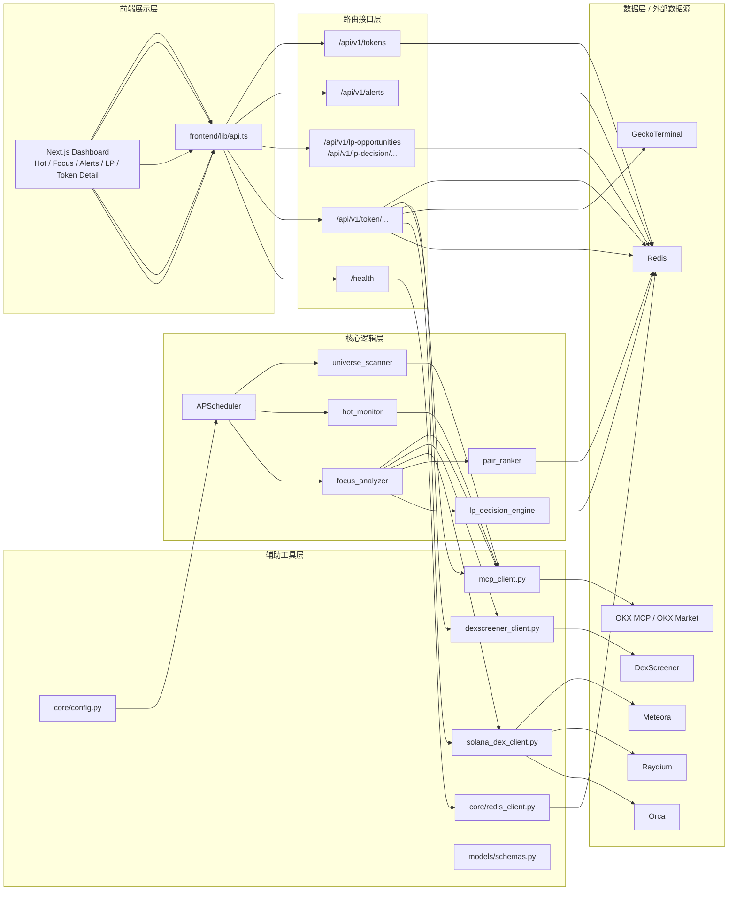
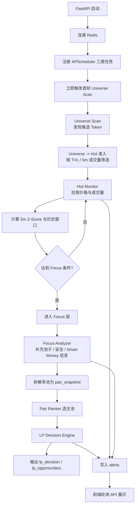
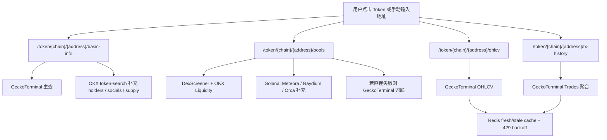

# LP-Sonar 项目评审与架构说明

## 1. 评审结论

### 1.1 项目定位

LP-Sonar 是一个面向 DeFi LP 机会发现与风险监控的前后端分离系统：

- 后端基于 `FastAPI + APScheduler + Redis`
- 前端基于 `Next.js`
- 业务主线是 `Universe -> Hot -> Focus -> LP Decision`
- 数据以 Redis 为中心进行分层缓存、排名、告警沉淀与短期历史存储

### 1.2 当前架构优点

- 分层思路清晰，任务流和接口流拆分明确
- Redis key 设计基本围绕业务实体展开，便于前端按层读取
- `focus_analyzer` 之后再进入 `pair_ranker / lp_decision_engine`，把 LP 决策与普通代币监控分离得比较干净
- `token_detail` 走“直连协议源优先 + 聚合源兜底 + Redis 短缓存”的查询链路，适合面板型产品

### 1.3 主要风险点

| 级别 | 问题 | 影响 |
| --- | --- | --- |
| 高 | `backend/app/core/redis_client.py` 默认在后端关闭时执行 `flushdb()` | 每次后端重启都会清空 `snapshot / hot / focus / alerts / history / lp_decision / gtcache` 等全部运行态数据，与 Redis AOF 持久化的目的相冲突 |
| 中 | `backend/app/services/hot_monitor.py` 中 `focus_cooldown` 计数先 `pipe.incr()`，后用 `redis.get()` 读取旧值 | Focus 降级回 Hot 的阈值会比配置值晚一轮生效，行为与 `FOCUS_COOLDOWN_ROUNDS` 的语义不完全一致 |
| 中 | `start.sh` 强依赖本机 Homebrew Redis，而 `docker-compose.yml` 只定义了 Redis 容器 | 启动方式存在“双轨制”，降低跨机器复现和交付一致性 |
| 中 | 主流程依赖多个外部 API，但仓库内没有自动化测试 | 调度链、打分链、fallback 链一旦回归，较难第一时间发现 |

## 2. 系统分层拓扑

## 3. 主流程图

## 4. Token Detail 独立查询链

`token_detail.py` 不依赖定时任务结果，而是面向用户手动查询走按需拉取路径：

## 5. 后端逻辑层说明

说明：当前后端以“模块 + 函数”组织为主，不是典型面向对象类设计。以下按职责说明核心模块。

### 5.1 `app/main.py`

- 负责 FastAPI 生命周期管理
- 启动时执行：
  - 预热 Redis 连接
  - 注册 Scheduler
  - 启动 Scheduler
  - 将 `universe_scan` 的首次执行时间调整为“立即执行”
- 关闭时执行：
  - 关闭 Scheduler
  - 关闭 Redis 连接

### 5.2 `app/tasks/scheduler.py`

- 注册三类后台任务
- 任务频率来自 `core/config.py`
- 三个固定任务：
  - `run_universe_scan`
  - `run_hot_monitor`
  - `run_focus_analysis`

### 5.3 `app/services/universe_scanner.py`

职责：全市场候选池发现与 Hot 初始准入。

核心逻辑：

- 从 OKX MCP 拉取：
  - `token_ranking`
  - `hot_tokens`
  - Solana 额外拉 `meme_token_list`
- 对 token 去重，并做基础过滤：
  - 必须有 `tokenContractAddress`
  - 必须有成交量
- 将结果写入 `universe:{chain}`
- 再调用 `_promote_universe_to_hot()`，通过以下准入条件推进到 Hot：
  - `liquidity >= MIN_TVL_USD`
  - `volume5M >= MIN_VOLUME_5M_USD`
- 同时初始化 `snapshot:{chain}:{token}` 的基础行情字段

输出：

- `universe:{chain}`
- `hot:{chain}`
- `snapshot:{chain}:{token}`

### 5.4 `app/services/hot_monitor.py`

职责：对 Hot 层 Token 做持续监控、历史建模、分层迁移和告警输出。

核心逻辑：

- 从 `hot:{chain}` 拉取候选 token
- 批量调用 OKX `get_token_price_info_batch`
- 维护 `history:{chain}:{token}` 的 48 个点滚动窗口
- 计算当前 `volume5M` 的 Z-Score
- 执行层级迁移：
  - `z_score >= HOT_TO_FOCUS_Z_SCORE` 或 `|priceChange5M| >= 3%` 进入 Focus
  - Focus token 低于阈值时，通过 `focus_cooldown:{chain}:{token}` 连续计数后降回 Hot
- 更新 snapshot
- 生成 `VOLUME_SPIKE / BREAKOUT` 告警
- 对缺失元数据的 token 补 symbol / name / logo

输出：

- `history:{chain}:{token}`
- `hot:{chain}`
- `focus:{chain}`
- `snapshot:{chain}:{token}`
- `alerts`

### 5.5 `app/services/focus_analyzer.py`

职责：对 Focus 层 Token 做深度补全，准备 LP 决策输入。

核心逻辑：

- 读取 `focus:{chain}` 的 top 50 token
- 拉取池子信息：
  - OKX token liquidity
  - DexScreener pools
  - Solana 额外补 Meteora / Raydium
- 拉取安全信息：
  - `riskLevelControl`
  - `isLpBurnt`
  - `isMint`
  - `isFreeze`
- 拉取 Smart Money 最近交易
- 将每个池子拆成 `pair_snapshot`
- 调用 `pair_ranker.rank_pairs_for_token()` 选主池
- 读取主池后调用 `run_lp_decision_for_pair()`
- 对高风险 Token 输出 `SAFETY_RISK` 告警

输出：

- `snapshot:{chain}:{token}` 的增强字段
- `pair_snapshot:{chain}:{pool}`
- `pool_vol_history:{chain}:{pool}`
- `primary_pool:{chain}:{token}`
- `alerts`

### 5.6 `app/services/pair_ranker.py`

职责：在一个 Token 的多个流动性池中选择“主池”。

评分维度：

- TVL
- 24h Volume
- Quote 资产质量
- 池龄
- 协议可信度

结果：

- 标记 `pair_snapshot` 的 `is_primary`
- 写入 `primary_pool:{chain}:{token}`

### 5.7 `app/services/lp_decision_engine.py`

职责：对主池生成最终 LP 决策。

流程：

1. `market_quality.detect_market_quality()`
2. `check_lp_eligibility()` 做硬性准入
3. `estimate_il_risk()` 评估无常损失风险
4. `recommend_holding_period()` 生成策略类型与持有建议
5. `_compute_net_lp_score()` 计算综合分

综合分主要考虑：

- 手续费收益潜力
- 成交量稳定性
- 市场质量
- IL 惩罚
- 尾部风险惩罚
- Smart Money 微弱加分

输出：

- `lp_decision:{chain}:{pool}`
- `lp_opportunities:{chain}`
- `alerts` 中的 `LP_OPPORTUNITY / LP_RISK_WARN`

### 5.8 `app/services/market_quality.py`

职责：基于启发式规则判断池子是否存在刷量、薄深度、极端单边成交。

输入：

- TVL
- 24h / 1h 成交量
- 估算买卖量
- 1 小时成交笔数

输出：

- `wash_score`
- `wash_risk`
- flags

### 5.9 `app/services/il_risk.py`

职责：基于价格波动、Z-Score、quote 类型、协议类型估算 IL 风险。

特点：

- `stable` quote 风险最高
- `wrapped_native` 认为有一定相关性对冲
- 对 CLMM / DLMM / Whirlpool 乘以额外风险系数

输出：

- `level`
- `score`
- `main_driver`

### 5.10 `app/services/holding_period.py`

职责：把可做 LP 的池子分成三类策略：

- `event`
- `tactical`
- `structural`

依据：

- Z-Score
- 价格变动
- TVL
- volume / TVL
- pool age
- fee APR
- IL 风险
- 市场质量

### 5.11 `app/api/v1/endpoints/token_detail.py`

职责：为前端明细页提供按需查询接口。

特点：

- `basic-info`：`GeckoTerminal 主查 + OKX 补字段`
- `pools`：`DexScreener + OKX + Solana 直连协议源`，必要时 `GeckoTerminal` 兜底
- `ohlcv` / `tx-history`：依赖 `GeckoTerminal`
- 使用 Redis 维护：
  - fresh cache
  - stale cache
  - 429 backoff
  - pool fee rate cache

这部分属于“查询增强链”，与定时任务的监控主链是并行关系。

## 6. 路由接口层说明

### 6.1 基础路由

| 接口 | 说明 | 主要读取 |
| --- | --- | --- |
| `GET /health` | 健康检查 | Redis 连通性 |

### 6.2 Token / Alert / LP 路由

| 接口 | 作用 | 数据来源 |
| --- | --- | --- |
| `GET /api/v1/tokens` | 读取 `hot` 或 `focus` 列表 | Redis `hot:{chain}` / `focus:{chain}` + `snapshot:*` |
| `GET /api/v1/alerts` | 返回最近告警 | Redis `alerts` |
| `GET /api/v1/lp-opportunities` | 返回按 `net_lp_score` 排序的 LP 机会 | Redis `lp_opportunities:*` + `lp_decision:*` |
| `GET /api/v1/lp-decision/{chain}/{pool}` | 查询单池完整 LP 决策 | Redis `lp_decision:*` |

### 6.3 Token Detail 路由

| 接口 | 作用 | 数据来源 |
| --- | --- | --- |
| `GET /api/v1/token/{chain}/{address}/basic-info` | Token 基础信息 | GeckoTerminal 主查，OKX token-search 补充 |
| `GET /api/v1/token/{chain}/{address}/pools` | 池列表、费率、成交/流动性 | DexScreener + OKX + Solana 直连协议源，GT 兜底 |
| `GET /api/v1/token/{chain}/{address}/ohlcv` | 单池历史成交量柱 | GeckoTerminal + Redis 短缓存 |
| `GET /api/v1/token/{chain}/{address}/tx-history` | 单池成交方向聚合 | GeckoTerminal + Redis 短缓存 |

## 7. 辅助工具层说明

### 7.1 `core/config.py`

- 统一定义 API URL、Redis URL、调度频率、阈值、链配置
- 通过 `pydantic-settings` 读取 `.env`
- `chain_list` 把 `MONITORED_CHAINS` 解析成数组

### 7.2 `core/redis_client.py`

- 维护 Redis 单例连接
- 当前实现中关闭应用时可选 `flushdb()`

### 7.3 `services/mcp_client.py`

- 对 OKX OnchainOS MCP 做统一 JSON-RPC 包装
- 对上层暴露的能力包括：
  - token ranking
  - hot token
  - token price info batch
  - token liquidity
  - token advanced info
  - recent trades
  - meme token list

### 7.4 `services/dexscreener_client.py`

- 跨链池子发现与行情补充
- 统一把 DexScreener pair 转成内部兼容结构
- 主要服务于 Focus 分析和 Token Detail 查询

### 7.5 `services/solana_dex_client.py`

- 只服务 Solana
- 直接接入：
  - Meteora DLMM
  - Meteora DAMM
  - Raydium
  - Orca
- 用于拿更准确的：
  - pool fee
  - pool metadata
  - pool liquidity / volume

### 7.6 `models/schemas.py`

- 定义 API 输出和内部决策结构
- 关键模型：
  - `TokenSnapshot`
  - `AlertRecord`
  - `PoolInfo`
  - `MarketQualityResult`
  - `EligibilityResult`
  - `ILRiskResult`
  - `HoldingPeriodResult`
  - `LPDecision`

## 8. 数据来源说明

### 8.1 数据源清单

| 数据源 | 角色 | 在项目中的用途 |
| --- | --- | --- |
| OKX OnchainOS MCP | 主业务数据源 | ranking、hot token、price batch、liquidity、安全信息、交易明细 |
| DexScreener | 跨链补充数据源 | 补池列表、价格、成交量、交易数 |
| GeckoTerminal | 明细查询与回退数据源 | basic-info、pools fallback、ohlcv、tx-history |
| Meteora | Solana 直连协议源 | DLMM / DAMM 池子与费率 |
| Raydium | Solana 直连协议源 | 池详情、费率 |
| Orca | Solana 直连协议源 | fee backfill |
| Redis | 内部状态存储 | 排名、snapshot、告警、缓存、历史、LP 决策 |

### 8.2 不同链路的数据优先级

#### 定时任务主链

1. Universe/Hot 以 OKX MCP 为主
2. Focus 层用 OKX + DexScreener + Solana 直连协议源做增强
3. LP Decision 只消费内部整理好的快照，不直接查外部源

#### Token Detail 查询链

1. `basic-info`：GeckoTerminal 优先，OKX 补 holders / socials
2. `pools`：直连源优先，GeckoTerminal 兜底
3. `ohlcv` / `tx-history`：GeckoTerminal 独占

### 8.3 当前未实际使用的配置项

以下配置已定义，但目前代码中没有实际消费：

- `okx_cex_base_url`
- `defillama_api_url`

说明项目有继续扩展空间，但当前版本尚未接入这两类数据。

## 9. Redis 数据面清单

| Key 模式 | 类型 | 用途 | TTL / 生命周期 |
| --- | --- | --- | --- |
| `universe:{chain}` | ZSET | 全市场候选 token 排名 | 2h |
| `hot:{chain}` | ZSET | Hot 层 token 排名 | 1h，Universe 扫描刷新 |
| `focus:{chain}` | ZSET | Focus 层 token 排名 | 10m，Hot Monitor 刷新 |
| `snapshot:{chain}:{token}` | HASH | token 最新快照 | 10m |
| `history:{chain}:{token}` | LIST | 5m 成交量历史窗口 | 固定长度 48 |
| `focus_cooldown:{chain}:{token}` | String | Focus 降级冷却计数 | 10m |
| `meta_tried:{chain}:{token}` | String | 元数据补全节流 | 1h / 24h |
| `pair_snapshot:{chain}:{pool}` | HASH | 单池快照 | 10m |
| `pool_vol_history:{chain}:{pool}` | LIST | 池子 1h volume 历史 | 固定长度 48 |
| `primary_pool:{chain}:{token}` | String | token 主池映射 | 10m |
| `lp_decision:{chain}:{pool}` | HASH | LP 决策结果 | 1h |
| `lp_opportunities:{chain}` | ZSET | LP 机会排序 | 1h |
| `alerts` | LIST | 告警流 | 保留最近 500 条 |
| `gtcache:*` | String | GeckoTerminal fresh/stale cache | 45s / 600s |
| `pool_fee:{dex}:{pool}` | String | Solana 池费率缓存 | 6h |

## 10. 前端消费关系

### 10.1 首页主面板

- `HotTable`
  - 每 60s 轮询 `/api/v1/tokens?layer=hot`
- `FocusPanel`
  - 每 30s 轮询 `/api/v1/tokens?layer=focus`
- `LPOpportunities`
  - 每 60s 轮询 `/api/v1/lp-opportunities`
- `AlertFeed`
  - 每 15s 轮询 `/api/v1/alerts`

### 10.2 明细页

`TokenDetailView` 会并行消费：

- `basic-info`
- `pools`
- `ohlcv`
- `tx-history`

因此前端展示与后端定时任务既有复用，也有独立查询路径。

## 11. 配置清单

### 11.1 后端环境变量

以下以 `backend/.env.example` 与 `core/config.py` 为准：

| 配置项 | 默认值 | 作用 | 备注 |
| --- | --- | --- | --- |
| `OKX_MCP_URL` | `https://web3.okx.com/api/v1/onchainos-mcp` | OKX MCP 地址 | 必填 |
| `OKX_ACCESS_KEY` | 空 | OKX 访问密钥 | 必填 |
| `OKX_CEX_BASE_URL` | `https://www.okx.com` | 预留 CEX API 地址 | 当前未使用 |
| `METEORA_API_URL` | `https://dlmm-api.meteora.ag` | Meteora DLMM | 默认值在代码中 |
| `METEORA_DAMM_API_URL` | `https://damm-v2.datapi.meteora.ag` | Meteora DAMM | 默认值在代码中 |
| `RAYDIUM_API_URL` | `https://api-v3.raydium.io` | Raydium API | 默认值在代码中 |
| `DEXSCREENER_API_URL` | `https://api.dexscreener.com` | DexScreener API | 默认值在代码中 |
| `DEFILLAMA_API_URL` | `https://yields.llama.fi` | 预留聚合源 | 当前未使用 |
| `REDIS_URL` | `redis://localhost:6379/0` | Redis 地址 | 必填 |
| `REDIS_FLUSH_ON_SHUTDOWN` | `true` | 关闭时是否清库 | 建议调整为 `false` |
| `UNIVERSE_SCAN_INTERVAL` | `900` | Universe 扫描周期 | 秒 |
| `HOT_POLL_INTERVAL` | `300` | Hot 监控周期 | 秒 |
| `FOCUS_POLL_INTERVAL` | `60` | Focus 分析周期 | 秒 |
| `MIN_TVL_USD` | `50000` | Universe -> Hot TVL 准入阈值 | 美元 |
| `MIN_VOLUME_5M_USD` | `10000` | Universe -> Hot 5m 成交量阈值 | 美元 |
| `HOT_TO_FOCUS_Z_SCORE` | `2.0` | Hot -> Focus 阈值 | Z-score |
| `FOCUS_TO_HOT_Z_SCORE` | `1.0` | Focus -> Hot 阈值 | Z-score |
| `FOCUS_COOLDOWN_ROUNDS` | `3` | Focus 回退冷却轮次 | 当前实现存在晚一轮问题 |
| `MONITORED_CHAINS` | `501,8453,56` | 监控链列表 | 逗号分隔 |
| `UNIVERSE_TOP_N` | `200` | Universe 提升到 Hot 的 topN | 每链 |

### 11.2 前端环境变量

| 配置项 | 默认值 | 作用 |
| --- | --- | --- |
| `NEXT_PUBLIC_API_URL` | `http://localhost:8000` | 前端访问后端 API 地址 |

### 11.3 端口与进程

| 组件 | 默认端口 | 启动方式 |
| --- | --- | --- |
| Frontend | `3000` | `npm run dev` |
| Backend | `8000` | `uvicorn app.main:app` |
| Redis | `6379` | 本机 redis 或 docker |

### 11.4 启动文件

| 文件 | 作用 | 备注 |
| --- | --- | --- |
| `start.sh` | 一键启动 Redis / Backend / Frontend | 当前依赖 Homebrew Redis |
| `stop.sh` | 一键停止服务 | 依赖 pid 文件或端口 |
| `docker-compose.yml` | 启动 Redis 容器 | 当前未与 `start.sh` 打通 |

## 12. 建议的配置核对清单

上线或交付前建议逐项确认：

- `OKX_ACCESS_KEY` 已配置
- `REDIS_FLUSH_ON_SHUTDOWN=false`
- `MONITORED_CHAINS` 是否覆盖目标链
- `MIN_TVL_USD / MIN_VOLUME_5M_USD` 是否符合当前市场环境
- 前端 `NEXT_PUBLIC_API_URL` 是否指向正确后端
- Redis 启动策略是否统一为 Docker 或本机服务
- 是否为外部 API 调用增加更清晰的超时、降级和监控
- 是否补充自动化测试和模拟数据回放

## 13. 后续优化建议

### 13.1 高优先级

- 去掉默认 `flushdb()`，改为显式的开发模式开关
- 修正 Focus 冷却计数逻辑，避免“读旧值”
- 统一启动链路：要么全 Docker，要么脚本和 compose 打通

### 13.2 中优先级

- 为 `Universe / Hot / Focus / LP Decision` 增加集成测试
- 为 Redis key 增加结构化说明或常量定义，减少 key 名散落
- 为外部 API 增加 metrics、失败率统计和告警

### 13.3 低优先级

- 把未使用配置项整理为 roadmap 或移除
- 给前端图表增加真实历史序列，而不是空 sparkline 占位

## 14. 总结

这个项目的核心价值不在“单次查 Token”，而在于：

- 用调度任务持续发现市场机会
- 用分层模型把 token 从候选集逐步推进到高关注集
- 用多池排序与 LP 决策引擎把“监控”升级成“可执行建议”

从工程结构上看，主链路已经比较完整，下一阶段最值得优先处理的是：

1. 运行态数据不要在重启时被默认清空
2. Focus 回退逻辑要和配置语义严格一致
3. 为多外部源依赖补齐测试与运维一致性
